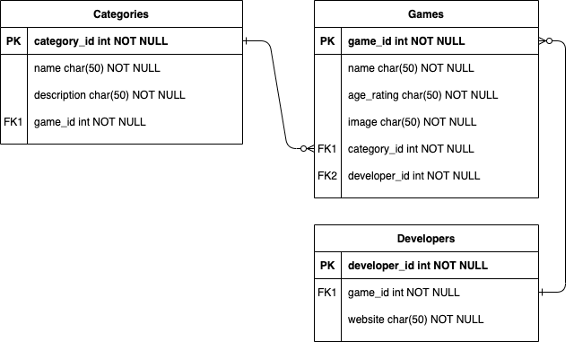

# Full Stack Capstone Project

This project was built as a requirement in Misk Academy-Udacity Full-Stack Developer Nanodegree.

## Table of Contents

* [Overview](#overview)
* [Technologies Used](#technologies-used)
* [Functions](#functions)
* [Structure](#structure)
* [ERD](#erd)
* [Installation](#installation)
* [Future Work](#future-work)

## Overview

This project is about building a full stack application for a game store to be used as point of sales (PoS). The user can add a new category, developer or game to the store, as well as edit or delete the exciting categories, developers or games.

You can find the deployed version at: `https://fsnd-gamify.herokuapp.com/`

## Technologies Used

* Python 3
* Pip
* Flask
* SQLAlchemy
* Auth0
* Postman
* Unittest
* Heroku
* Github

## Functions

The application can:

1. Allow public users to view all categories, developers and games in the system.
2. Allow the store's employees to see categories, developers and games details.
3. Allow the store's owner to create new categories, developers and games.
4. Allow the store's owner to delete existing categories, developers and games.
5. Allow the store's owner to edit existing categories, developers and games.

Refer to [API Documentation](routes/README.md) for instructions on API usage.

## Structure

```bash
├── app.py
├── auth
│   └── auth.py
├── database
│   └── models.py
└── routes
    ├── api.py
    └── web.py
```

* app.py is to create and configure the application.
* auth.py handles authentication and authorization.
* models.py setup database and creates model tables.
* api.py is used to used to interact with the server using api.
* web.py is used to return web pages (front-end).

> Note: the front-end is still work in progress, so you might face bugs.

## ERD



## Installation

### Installing Dependencies

#### Python 3.7

Follow instructions to install the latest version of python for your platform in the [python docs](https://docs.python.org/3/using/unix.html#getting-and-installing-the-latest-version-of-python)

#### PIP Dependencies

Install dependencies by running:

```bash
pip install -r requirements.txt
```

This will install all of the required packages we selected within the `requirements.txt` file.

##### Key Dependencies

* [Flask](https://flask.palletsprojects.com/en/1.1.x/) is a lightweight backend microservices framework. Flask is required to handle requests and responses.

* [SQLAlchemy](https://www.sqlalchemy.org/) is the Python SQL toolkit and ORM we'll use handle the lightweight sqlite database. You'll primarily work in app.py and can reference models.py.

* [Flask-CORS](https://flask-cors.readthedocs.io/en/latest/#) is the extension we'll use to handle cross origin requests from our frontend server.

### Database Setup

With Postgres running, restore a database using the gamify.psql file provided. From the project folder in terminal run:

```bash
psql gamify < gamify.psql
```

### Running the Server

To run the server, execute:

```bash
export FLASK_APP=app.py
export FLASK_DEBUG=true
export FLASK_ENVIRONMENT=development
flask run
```

Setting the `FLASK_ENV` variable to `development` will detect file changes and restart the server automatically.

Setting the `FLASK_APP` variable to app directs flask to use the app.py file.

### Testing

To run the tests, run:

```bash
dropdb gamify_test
createdb gamify_test
psql gamify_test < gamify.psql
python test_app.py
```

## Future Work

* Add more information about games such as shelves, quantity or price.
* Implement a Customer role.
* Add the ability to order online.
* Add messaging feature between employees and customers.
